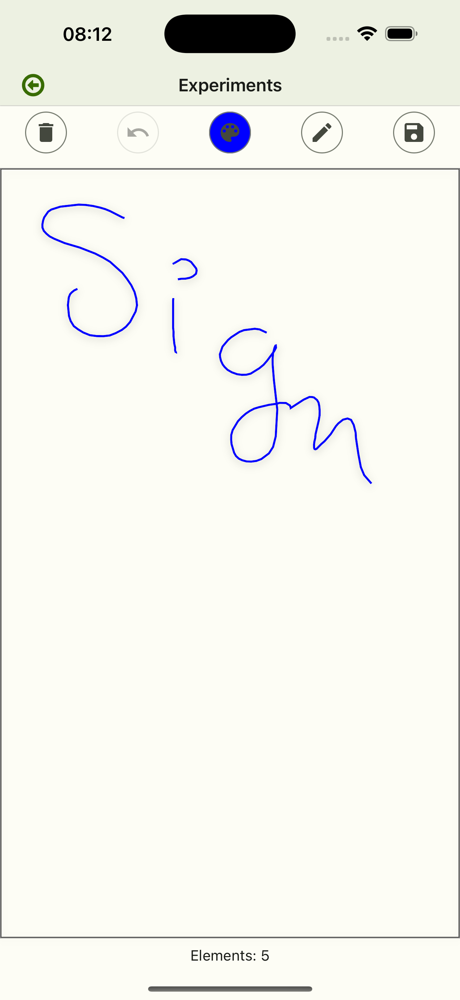
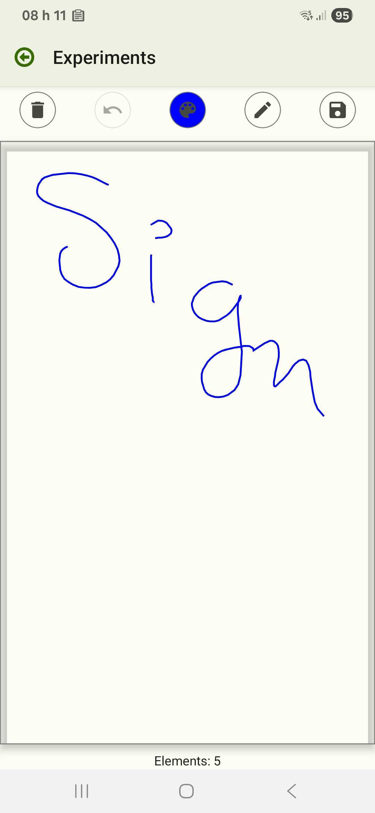

# react-native-sign-here

   

[](https://www.npmjs.com/package/@amwebexpert/react-native-sign-here)
[](https://www.npmjs.com/package/@amwebexpert/react-native-sign-here) [](./LICENSE)  


A React Native signature pad with SVG support and smooth drawing capabilities. Perfect for capturing digital signatures and handwriting in mobile applications. Built with the following native dependencies:

- [`react-native-svg`](https://www.npmjs.com/package/react-native-svg)
- [`react-native-gesture-handler`](https://www.npmjs.com/package/react-native-gesture-handler)
- [`react-native-reanimated`](https://www.npmjs.com/package/react-native-reanimated)

## Screenshots

iOS                                                   | Android
------------------------------------------------------|----------------------------------------------------------
 | 

## Why Choose `react-native-sign-here`?

### Key Advantages

- **Native Performance**: Built with native React Native components (SVG + Gesture Handler) instead of WebView, providing smoother drawing and better performance.
- **Lightweight**: No WebView dependency means smaller bundle size and faster startup times.
- **Better Integration**: Seamless integration with the React Native ecosystem and easier debugging.

## Features

- Smooth signature drawing with gesture handling
- SVG-based rendering for crisp signatures
- Support for both `iOS` and `Android` platforms, compatible with Expo SDK
- Built-in `TypeScript` definitions
- Customizable stroke width and color
- Undo, Clear, and Reset features
- Import & Export SVG signatures as XML

> **Note**: Import / Export are in XML (SVG file format) by default. If your project requires a bitmap format (like PNG or JPEG) consider using [react-native-view-shot](https://github.com/gre/react-native-view-shot).

If this project has helped you, please support us with a GitHub star 🌟.

### Alternative Libraries

- [react-native-signature-canvas](https://npmjs.com/package/react-native-signature-canvas)
- [react-native-canvas](https://npmjs.com/package/react-native-canvas)


## Setup

### Installation

To install the library and all its peer dependencies, run one of the following commands:

```bash
yarn add react-native-sign-here react-native-gesture-handler react-native-reanimated react-native-svg
```

or

```bash
npm install --save react-native-sign-here react-native-gesture-handler react-native-reanimated react-native-svg
```

### Basic Usage

The simplest way to use the signature pad:

```tsx
import React, { useRef } from 'react';
import { View, Button } from 'react-native';
import DrawHere, { ExportFormat, DrawHereRef } from 'react-native-sign-here';

const SignatureScreen = () => {
  const signatureRef = useRef<DrawHereRef>(null);

  const handleSave = async () => {
    if (signatureRef.current) {
      const svg = await signatureRef.current.exportSvg();
      console.log('Signature SVG:', svg);
    }
  };

  const handleClear = () => {
    signatureRef.current?.clear();
  };

  return (
    <View style={{ flex: 1, padding: 20 }}>
      <DrawHere
        ref={signatureRef}
        strokeColor="black"
        strokeWidth={1}
        onChange={(state: DrawingState) => {
          console.log('Drawing state changed:', state);
        }}
      />
      <Button title="Save Signature" onPress={handleSave} />
      <Button title="Clear" onPress={handleClear} />
    </View>
  );
};
```

### Advanced Usage

#### Custom Styling and Configuration

```tsx
import React, { useRef, useState } from 'react';
import { View, Button, Text } from 'react-native';
import DrawHere, { DrawingState, ExportFormat, DrawHereRef } from 'react-native-sign-here';

const AdvancedSignatureScreen = () => {
  const signatureRef = useRef<DrawHereRef>(null);
  const [isSigned, setIsSigned] = useState(false);

  const handleSignatureChange = (state: DrawingState) => {
    setIsSigned(state.elements.length > 0);
  };

  const handleUndo = () => {
    signatureRef.current?.undo();
  };

  const handleReset = () => {
    signatureRef.current?.reset();
  };

  const handleImportSvg = () => {
    const sampleSvg = `<svg width="200" height="100">
      <path d="M10 10 L50 50 L90 10" stroke="#000" stroke-width="2" fill="none"/>
    </svg>`;
    signatureRef.current?.importSvg(sampleSvg);
  };

  return (
    <View style={{ flex: 1, padding: 20 }}>
      <Text style={{ fontSize: 18, marginBottom: 10 }}>
        {isSigned ? 'Signature captured' : 'Please sign below'}
      </Text>
      
      <DrawHere
        ref={signatureRef}
        strokeColor="#2E86AB"
        strokeWidth={3}
        onChange={handleSignatureChange}
      />
      
      <View style={{ flexDirection: 'row', justifyContent: 'space-around', marginTop: 20 }}>
        <Button title="Undo" onPress={handleUndo} />
        <Button title="Reset" onPress={handleReset} />
        <Button title="Import SVG" onPress={handleImportSvg} />
      </View>
    </View>
  );
};
```

### Even more advanced usage 

- [Expo SDK demo screen](https://github.com/amwebexpert/poc-archiver-expo/blob/master/src/features/experiments/native-signature-pad.tsx)

## Examples

Working examples are available in the `src/examples/` directory:

- **Basic Usage**: Simple signature capture with save and clear functionality
- **Advanced Usage**: Custom styling, undo/reset, and SVG import capabilities  
- **Form Validation**: Integration with form validation and submission


## API Reference

### DrawHere Component

The main component for capturing signatures and drawings.

#### Props

| Prop          | Type                            | Default     | Description                               |
|---------------|---------------------------------|-------------|-------------------------------------------|
| `strokeColor` | `string`                        | `"black"`   | Color of the drawing stroke               |
| `strokeWidth` | `number`                        | `1`         | Width of the drawing stroke               |
| `onChange`    | `(state: DrawingState) => void` | `undefined` | Callback fired when drawing state changes |

#### Ref Methods

| Method                  | Parameters                | Return Type | Description                                     |
|-------------------------|---------------------------|-------------|-------------------------------------------------|
| `clear()`               | -                         | `void`      | Clears all drawings from the canvas             |
| `undo()`                | -                         | `void`      | Undoes the last drawing action                  |
| `reset(elements?)`      | `SvgElement[]` (optional) | `void`      | Resets the canvas, optionally with new elements |
| `exportSvg()`           | -                         | `string`    | Exports the drawing as SVG string               |
| `importSvg(svgContent)` | `string`                  | `void`      | Imports an SVG string into the canvas           |

## References

* [Useful Information & Commands](docs/usefull-commands.md)
* [Contributing](docs/CONTRIBUTING.md)

## License

This project is licensed under the MIT License - see the [LICENSE](LICENSE) file for details.
